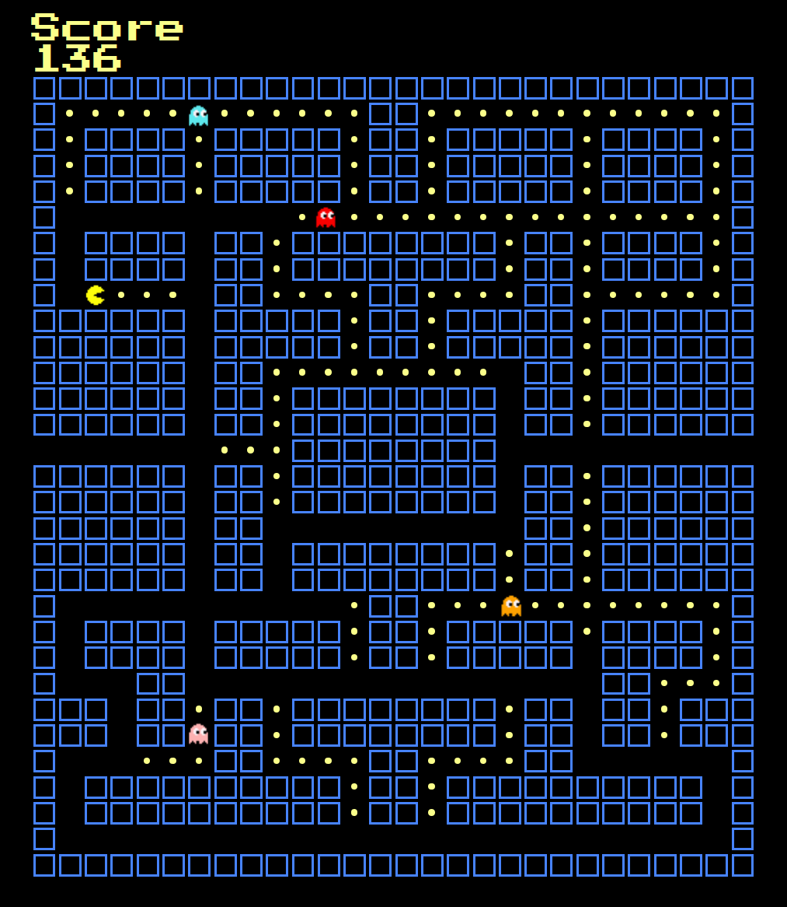

# Java-Man

A JavaScript Pacman Clone

### By: Dom DeLorenzo

***
### ***Description***
Java-Man is a browser-based Pac-Man clone, written in JavaScript.

***

### ***Screenshots***
(will replace with actual screenshot when game is done)

***

### ***Technologies***
* CSS
* JavaScript

***

### ***Roadmap (Future Updates)***

***

### ***Getting Started***

1. Click *Start Game* to begin.
2. Move your player with direction keys (<^>)
3. Avoid the ghosts!

***

### ***Credits***